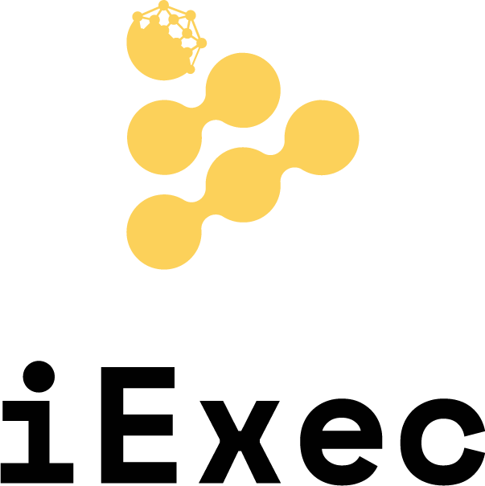

<p align="center">
  <a href="https://iex.ec/" rel="noopener" target="_blank"></a>
</p>

<h1 align="center">DataProtector</h1>

**DataProtector** offers developers methods to create apps that provide users with unparalleled ownership over their data.

Through DataProtector, users may allow apps to use their data without ever revealing the data itself. This revolutionary approach to data management relies on:

- end-to-end encryption backed by a secure hardware environment that prevents apps from accessing users’ unencrypted data
- smart contracts that manage apps’ rights to use users’ encrypted data.

DataProtector bundles 5 methods:

- protectData — that safeguards any type of data via end-to-end encryption and hardware security while recording data ownership on a smart contract to ensure verifiability and traceability
- grantUsage — that enables an app to use users’ data without ever revealing the data itself
- revokeUsage — that disables an app to use users’ data without ever disclosing it
- fetchProtectedData — that retrieves the data that has already been protected by DataProtector
- fetchGrantedUsage — that provides the list of the apps that are allowed to use existing protected data.

<div align="center">

**[Stable channel v1](https://iex.ec/)**

[]

</div>

## Installation

### DataProtector

DataProtector is available as an [npm package](https://www.npmjs.com/package/dataprotector-sdk).

**npm:**

```sh
npm install dataprotector-sdk
```

**yarn:**

```sh
yarn add dataprotector-sdk
```

## Documentation

[//]: # 'Add link to documentation gitbook when published'

- [DataProtector](#documentation)

## License

This project is licensed under the terms of the
[Apache 2.0](/LICENSE).
