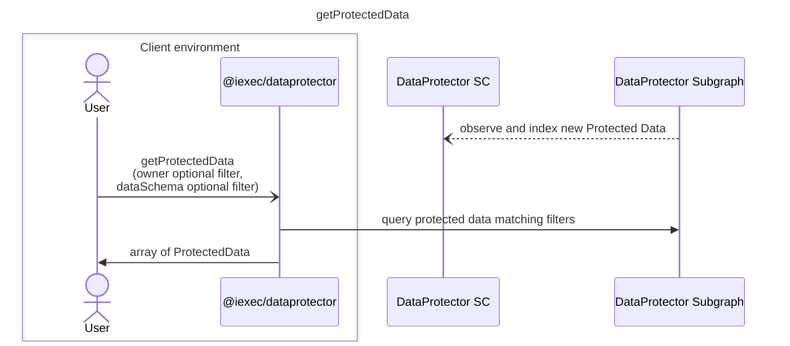

# getProtectedData

```mermaid
sequenceDiagram
    title getProtectedData

    box Client environment
        actor User
        participant SDK as @iexec/dataprotector
    end

    participant DPSC as DataProtector SC
    participant DPSG as DataProtector Subgraph

    DPSG --) DPSC: observe and index new Protected Data

    User -) SDK: getProtectedData<br>(owner optional filter,<br>dataSchema optional filter)

    SDK ->> DPSG: query protected data matching filters

    SDK ->> User: array of ProtectedData
```

[<-- back](../index.md)
