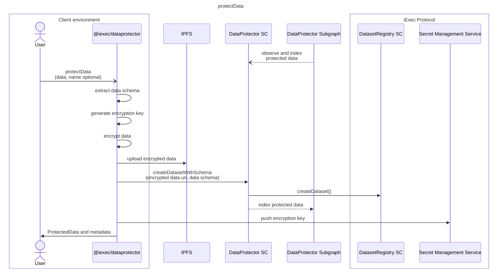

# protectData

## resources

- **dataset**: iExec's protocol NFT (Non-Fungible Token) providing governance over a confidential data, the dataset is the backbone of a protected data
- **datasetorder**: iExec's protocol document expressing a subset of governance rules signed by the owner of a dataset, datasetorders are referred as GrantedAccess by DataProtector
- [iExec protocol documentation](https://protocol.docs.iex.ec)

[<-- back](../index.md)
