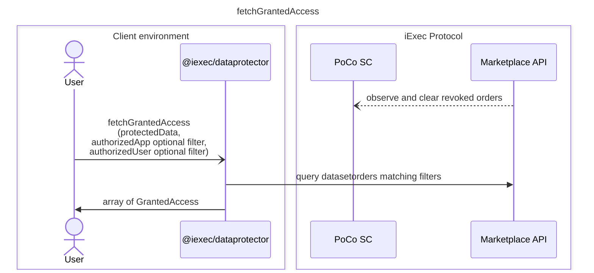

# fetchGrantedAccess

```mermaid

sequenceDiagram
    title fetchGrantedAccess

    box Client environment
        actor User
        participant SDK as @iexec/dataprotector
    end
    box iExec Protocol
        participant POCO as PoCo SC
        participant Market as Marketplace API
    end

    Market --) POCO : observe and clear revoked orders

    User -) SDK: fetchGrantedAccess<br>(protectedData,<br>authorizedApp optional filter,<br>authorizedUser optional filter)

    SDK ->> Market: query datasetorders matching filters

    SDK ->> User: array of GrantedAccess
```

[<-- back](../index.md)
