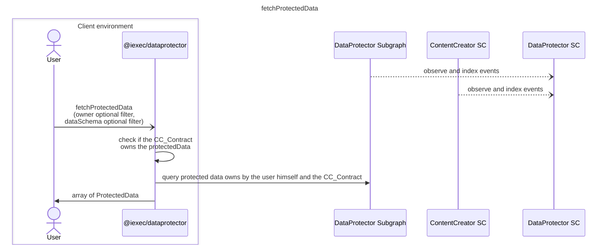

# fetchProtectedData

```mermaid
sequenceDiagram
    title fetchProtectedData

    box Client environment
        actor User
        participant SDK as @iexec/dataprotector
    end

    participant DPSG as DataProtector Subgraph
    participant CCSC as ContentCreator SC
    participant DPSC as DataProtector SC

    DPSG --) DPSC: observe and index events

    CCSC --) DPSC: observe and index events

    User -) SDK: fetchProtectedData<br>(owner optional filter,<br>dataSchema optional filter)

    SDK ->> SDK: check if the CC_Contract <br> owns the protectedData


    SDK ->> DPSG: query protected data owns by the user himself and the CC_Contract

    SDK ->> User: array of ProtectedData
```

[<-- back](../index.md)
