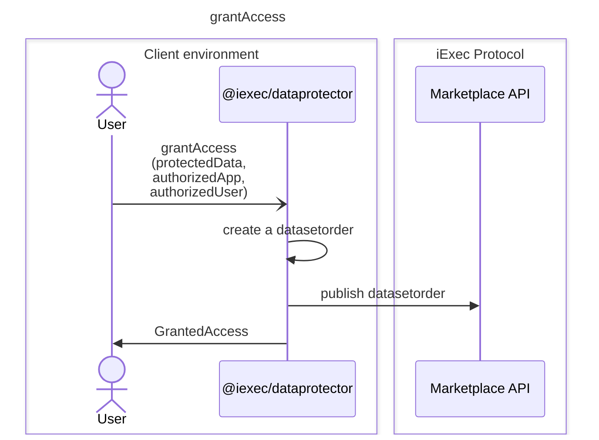

# grantAccess

```mermaid
sequenceDiagram
    title grantAccess

    box Client environment
        actor User
        participant SDK as @iexec/dataprotector
    end
    box iExec Protocol
        participant Market as Marketplace API
    end

    User -) SDK: grantAccess<br>(protectedData,<br>authorizedApp,<br>authorizedUser)

    SDK ->> SDK: create a datasetorder

    SDK ->> Market: publish datasetorder

    SDK ->> User: GrantedAccess
```

[<-- back](../index.md)
