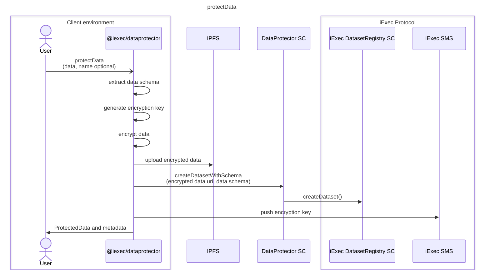

# protectData

```mermaid
sequenceDiagram
    title protectData

    box Client environment
        actor User
        participant SDK as @iexec/dataprotector
    end
    participant IPFS
    participant DPSC as DataProtector SC
    box iExec Protocol
        participant DRSC as iExec DatasetRegistry SC
        participant SMS as iExec SMS
    end

    User -) SDK: protectData<br>(data, name optional)

    SDK ->> SDK: extract data schema

    SDK ->> SDK: generate encryption key

    SDK ->> SDK: encrypt data

    SDK ->> IPFS: upload encrypted data

    SDK ->> DPSC: createDatasetWithSchema<br>(encrypted data uri, data schema)

    DPSC ->> DRSC: createDataset()


    SDK ->> SMS: push encryption key

    SDK ->> User: ProtectedData and metadata
```

[<-- back](../index.md)
