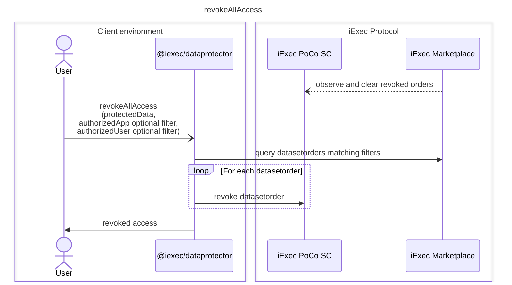

# revokeAllAccess

```mermaid
sequenceDiagram
    title revokeAllAccess

    box Client environment
        actor User
        participant SDK as @iexec/dataprotector
    end

    box iExec Protocol
        participant POCO as iExec PoCo SC
        participant Market as iExec Marketplace
    end

    Market --) POCO : observe and clear revoked orders

    User -) SDK: revokeAllAccess<br>(protectedData,<br>authorizedApp optional filter,<br>authorizedUser optional filter)

    SDK ->> Market: query datasetorders matching filters

    loop For each datasetorder
        SDK ->> POCO: revoke datasetorder
    end

    SDK ->> User: revoked access
```

[<-- back](../index.md)
