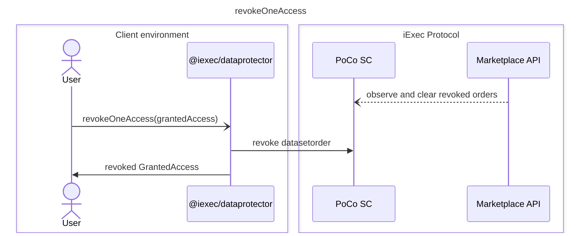

# revokeOneAccess

```mermaid
sequenceDiagram
    title revokeOneAccess

    box Client environment
        actor User
        participant SDK as @iexec/dataprotector
    end

    box iExec Protocol
        participant POCO as PoCo SC
        participant Market as Marketplace API
    end

    Market --) POCO : observe and clear revoked orders

    User -) SDK: revokeOneAccess(grantedAccess)

    SDK ->> POCO: revoke datasetorder

    SDK ->> User: revoked GrantedAccess
```

[<-- back](../index.md)
